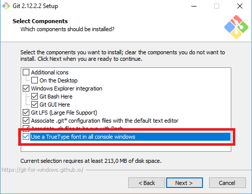

## Configuração do ambiente

No primeiro passo nós vamos preparar o ambiente de desenvolvimento e criar um primeiro programa executável para testar se tudo está funcionando corretamente.

Você vai precisar de:
- Um computador com acesso à internet

Você vai terminar esta etapa com:
- Uma instalação do Go funcionando
- Um editor de texto simples com o qual você se sinta confortável
- Um programa em Go que escreve "Hello Go!" na tela

Nota: para programação nós não utilizamos editores que formatam texto (por exemplo, Microsoft Word), nós usamos os editores de texto simples (em inglês *plain-text*).

Sugestões de editores de texto:
- MacOS: atom
- Linux: gedit
- Windows: Notepad++

### Instalação do Go

#### Instalação MacOS

Temos duas opções de como instalar o Go no MacOS: usando Homebrew ou o instalador de pacotes do MacOS.

##### Instalando Homebrew (Opcional)

O jeito mais simples de instalar o Go é usando o [Homebrew](https://brew.sh/), que é um gerenciador de pacotes para o MacOS. Para instalar o Homebrew basta rodar o seguinte comando no terminal:

```
/usr/bin/ruby -e "$(curl -fsSL https://raw.githubusercontent.com/Homebrew/install/master/install)"
```

O próprio script de intalação do Homebrew explica o que esta fazendo e pausa quando necessário.

##### Instalando Go

Caso você tenha instalado o Homebrew, basta rodar:

```
brew install go
```

Caso você tenha optado pelo instalador de pacotes do MacOS, abra a [página de downloads](https://golang.org/dl/) do Go procure pelo arquivo do instalador para MacOS e clique no link. Os arquivos serão instalados por padrão em `/usr/local/go`.

Em ambos os casos, após a instalação a sua variável de ambiente `PATH` já deve conter o binário do go. Para que o comando possa ser utilizado é possível que você tenha que reiniciar as sessões do terminal que estão abertas.

Para garantir que a instalação foi bem sucedida e que o Go foi instalado corretamente, basta rodar o comando `go version` e observar uma saída parecida com a seguinte:

```
❯ go version
go version go1.8.1 darwin/amd64
```

#### Instalação Linux

##### Instalando Go

Se você usa uma distribuição do Linux baseada no Debian, como o Ubuntu, basta rodar o seguinte comando:

```
sudo apt-get install golang-1.8-go
```

Para outras distribuições de linux o primeiro passo para instalar o Go é baixar o arquivo .tar.gz, para isso abra a [página de downloads](https://golang.org/dl/) do Go procure pelo link correto.

Em seguida será necessário extrair o conteúdo do arquivo baixado em `/usr/local`, para criar uma árvore dos arquivos do Go em `/usr/local/go`.

```
sudo tar -C /usr/local -xzf go$VERSION.$OS-$ARCH.tar.gz
```

Por exemplo, se você baixou o arquivo `go1.8.1.linux-amd64.tar.gz`:
```
sudo tar -C /usr/local -xzf go1.8.1.linux-amd64.tar.gz
```

Finalmente, tanto para a instalação com `apt-get` quanto com o arquivo .tar.gz é necessário adicionar o binário do Go à sua variável de ambiente `PATH`. Para fazer isso adicione ao bash profile `$HOME/.profile` a linha seguinte:

```
export PATH=$PATH:/usr/local/go/bin
```

Para que o comando possa ser utilizado é possível que você tenha que reiniciar as sessões do terminal que estão abertas.

Para garantir que a instalação foi bem sucedida e que o Go foi instalado corretamente, basta rodar o comando `go version` e observar uma saída parecida com a seguinte:

```
ubuntu@svartir-sandar:~$ go version
go version go1.8.1 linux/amd64
```

#### Instalação Windows

##### Instalando Git

O primeiro passo é instalar o Git. O jeito mais fácil é fazer o download do [Git For Windows](https://git-for-windows.github.io/). A vantagem de utilizar o Git For Windows é que também será instalado o Git Bash. No caso desse tutorial, faremos os personagens do jogo usando caracteres Unicode. Infelizmente, o prompt de comando do Windows não consegue exibir os caracteres Unicode, então para esse tutorial usaremos o Git Bash que suporta esses caracteres.

Para instalar o Git For Windows basta clicar no link acima e então em Download. Siga os passos da instalação normalmente até chegar na tela de seleção de componentes. Nessa tela é muito importante selecionar a opção "Use a TrueType font in all console windows". É essa opção que vai fazer com que os caracteres Unicode sejam exibidos corretamente.



Continue seguindo as instruções de instalação até a tela de configuração do emulador de terminal que será utilizado pelo Git Bash. Nessa tela selecione a opção "Use MinTTY (the default terminal of MSYS2)". Juntamente com a opção selecionada anteriormente, essa opção também garantirá a exibição correta dos carcteres Unicode.


Após essa tela continue seguindo as instruções do instalador até que o Git For Windows seja instalado. Ao fim da instalação abra o Git Bash.

##### Instalando Go

O jeito mais simples de instalar o Go no Windows é utilizar o instalador MSI. Na [página de downloads](https://golang.org/dl/) do Go procure pelo arquivo do instalador para Windows e clique no link. Os arquivos serão instalados por padrão em `C:\Go`.

Após a instalação a sua variável de ambiente `PATH` já deve conter o binário do go (`C:\Go\bin`). Para que o comando possa ser utilizado é possível que você tenha que reiniciar o Git Bash que está aberto.

Para garantir que a instalação foi bem sucedida e que o Go foi instalado corretamente, basta rodar o comando `go version` e observar uma saída parecida com a seguinte:

```
C:\Users\Camila\Documents\GitHub> go version
go version go1.8.1 windows/amd64
```

### Configurando o Workspace do Go

A linguagem Go necessita que todo o código Go esteja localizado em um único workspace. O workspace é uma pasta que contém três sub-pastas: uma pasta `src`, que contém todos os arquivos fonte em Go. Uma pasta `pkg`, que contém os objetos dos pacotes e uma pasta `bin` que contém os comandos executáveis. Para mais detalhes leia a [documentação](https://golang.org/doc/code.html#Workspaces) da linguagem.

A localização do workspace é definido por uma varável de ambiente chamada `GOPATH`. A localização padrão dessa variável é `%USERPROFILE%\go` (geralmente C:\Users\SeuNome\go) no Windows ou `$HOME/go` no caso do MacOS e Linux. Nesse tutorial usaremos a localização padrão do workspace. Caso você deseje utilizar outro local será necessário alterar o valor do `GOPATH` para que seu programa funcione corretamente.

Para criar o workspace na localização padrão vá até a pasta home e crie a pasta `go`. Dentre as três sub-pastas do workspace, apenas a pasta `src` precisa ser criada:

#### MacOS / Linux / Windows (usando Git Bash)
```
cd ~
mkdir go
cd go
mkdir src
cd src
```

#### Windows (usando linha de comando do Windows)
```
cd %USERPROFILE%
mkdir go
cd go
mkdir src
cd src
```

Pronto! É dentro desta pasta `src` onde você pode começar a construir seu primeiro programa em Go :)
